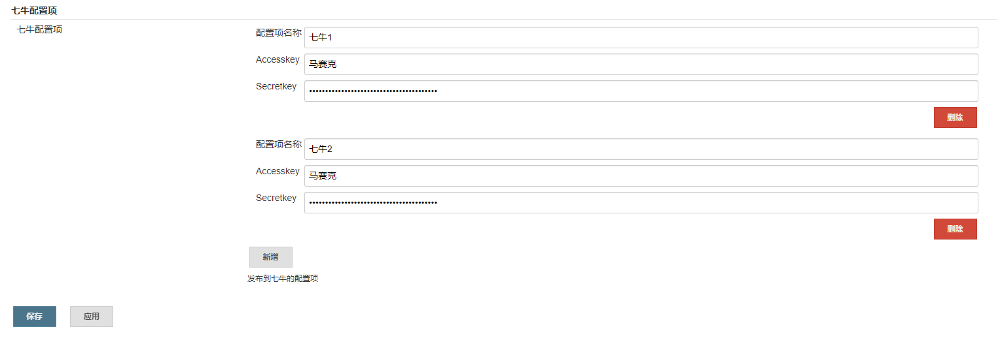
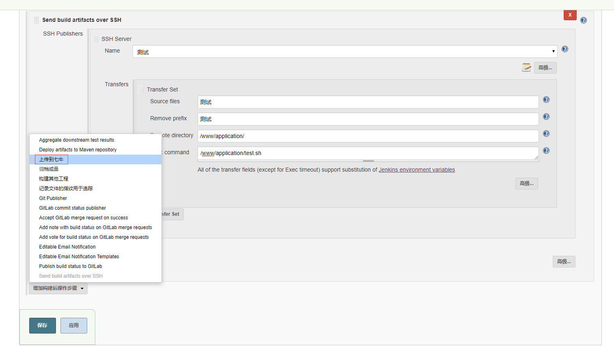
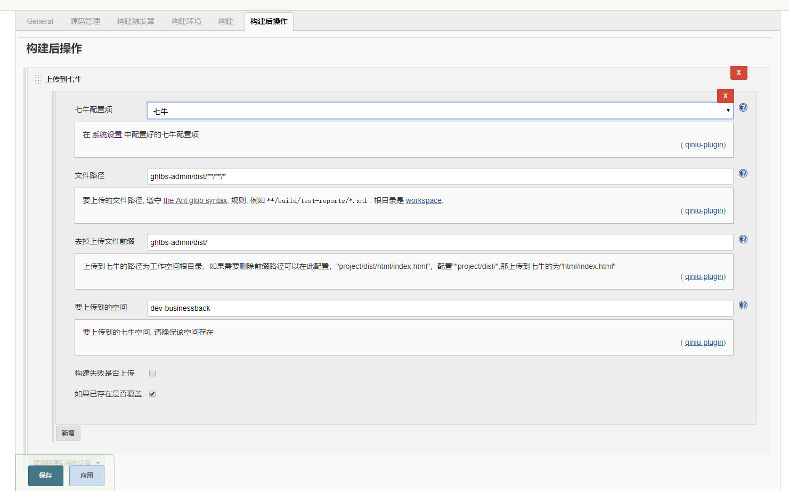
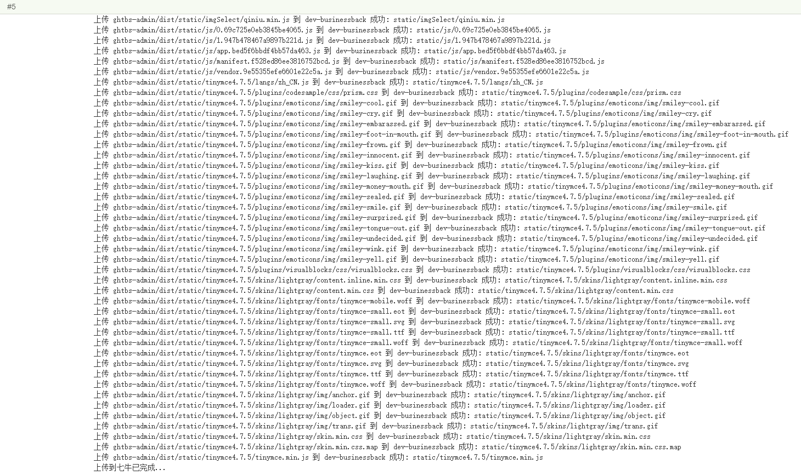

# qiniu-plugin
Jenkins 的七牛插件,可以将构建好的结果上传到七牛.
插件包下载地址: [qiniu-plugin](https://github.com/jun4997/qiniu-plugin/releases)

1. 在全局配置里设置 App Key 和 Secret Key

2. 在 Post-build action 里添加"上传到七牛"的选项

3. 选择要上传的文件和 bucket

4. 运行结果

